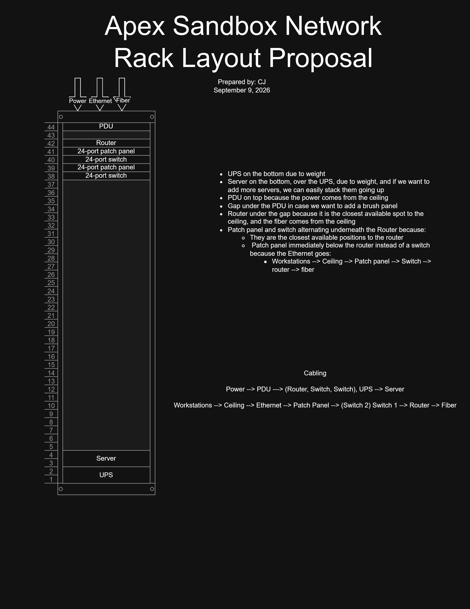
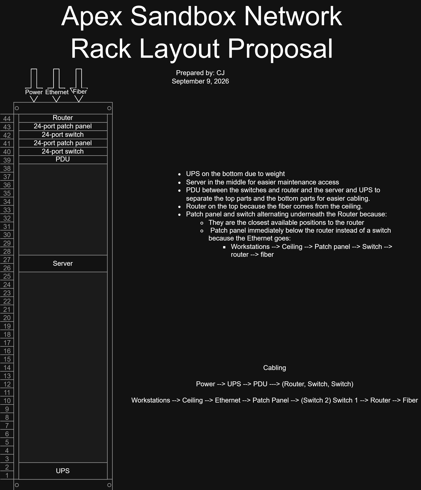

# CS Network Rack Layout Proposal

Images | August 2026

## Summary

In this project, we were provided a server rack template and we were instructed to do research and then create an optimal layout. After we were done, the district Network Engineer came to our class as a guest speaker and gave us feedback on our layout. the first image is my original layout design and the second one is the edited version after the feed feedback.

**Project:** CS Network Rack Layout Proposal

**My role:** Yanixan and I communicated extensively together in order to best optimize the network rack proposal.

## The Artifact

Original network rack layout proposal

[View the full artifact](./Network_Rack_Proposal_Template.drawio.png)

Revised version of the network layout proposal

[View the full artifact](./Network_Rack_Proposal_Revised.drawio.png)

## Skills Demonstrated

Collaboration
Responsibility & Reliability
Researching
Layout Creation & Optimization

## What I Learned

I learned what components in a server rack do and how to optimally arrange them.

---

[Return to All Artifacts]({{ '/artifacts.html' | relative_url }})