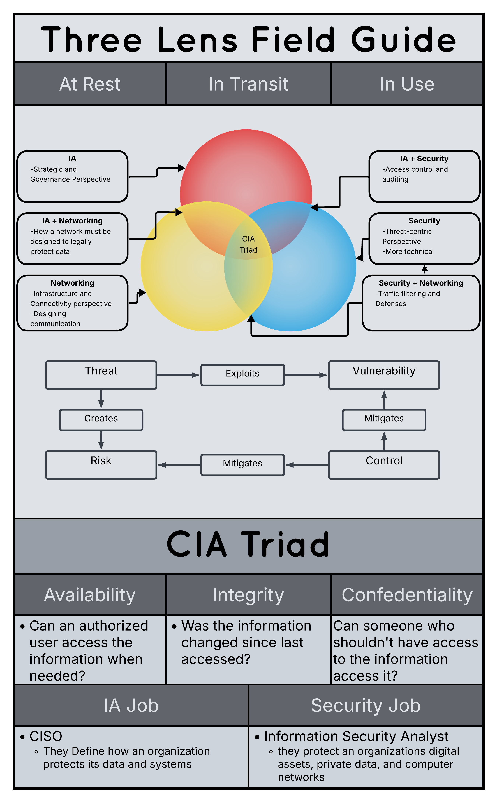

# CS Three Lens Field Guide

Image | September 2026

## Summary

We were instructed by our teacher to make a pamphlet that explains the three lenses, Networking, Security, and Information Assurance.

**Project:** CS Lab and Rack Setup

**My role:** I worked on my own on LucidChart to make a three lenses field guide.

## The Artifact

[View the full artifact](./three-lens-field-guide-image.png)

## Skills Demonstrated

Defining Key Terms
Graphics Design
Responsibility & Reliability

## What I Learned

I learned how to improve my time management skills

---

[Return to All Artifacts]({{ '/artifacts.html' | relative_url }})