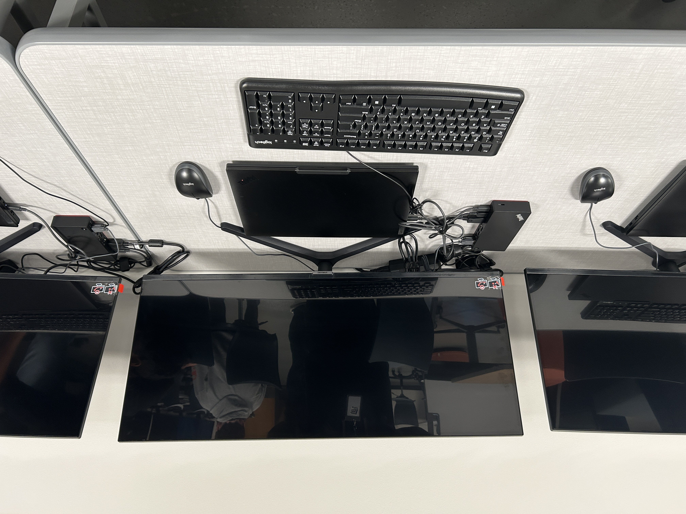
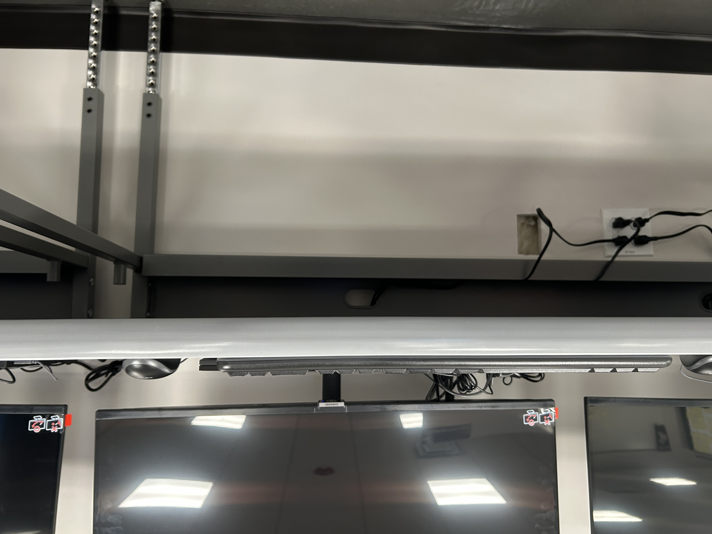
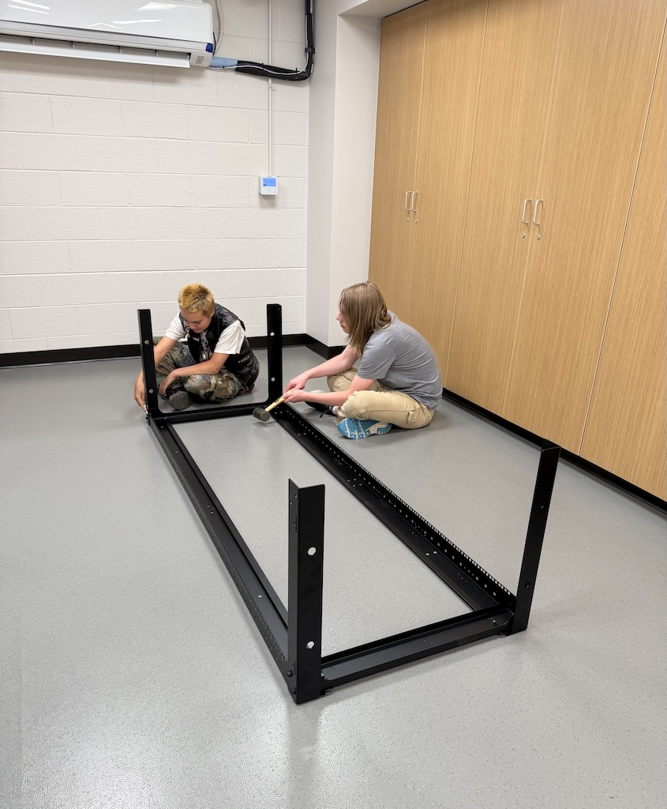
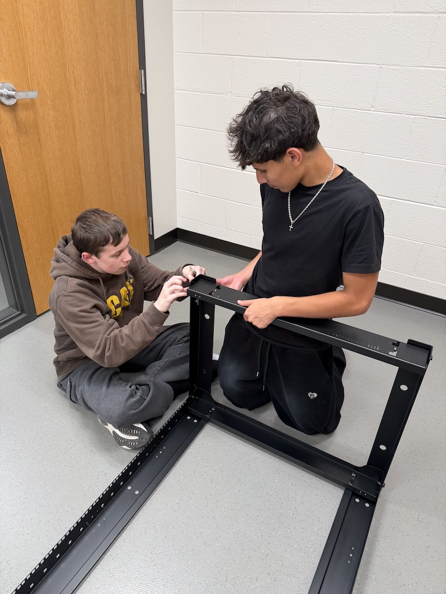
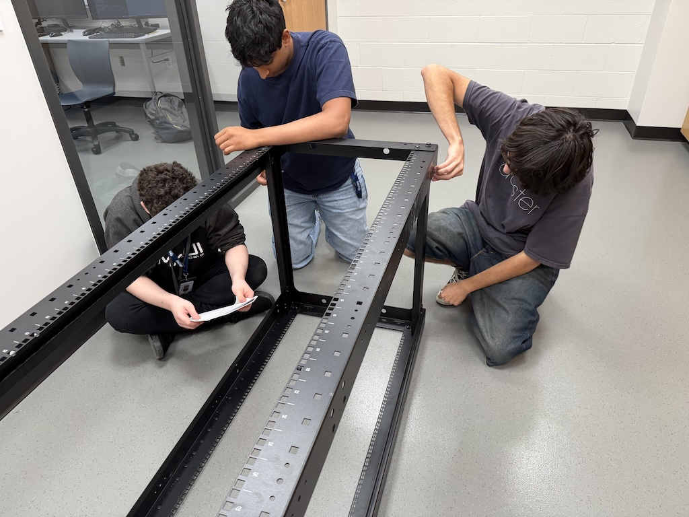
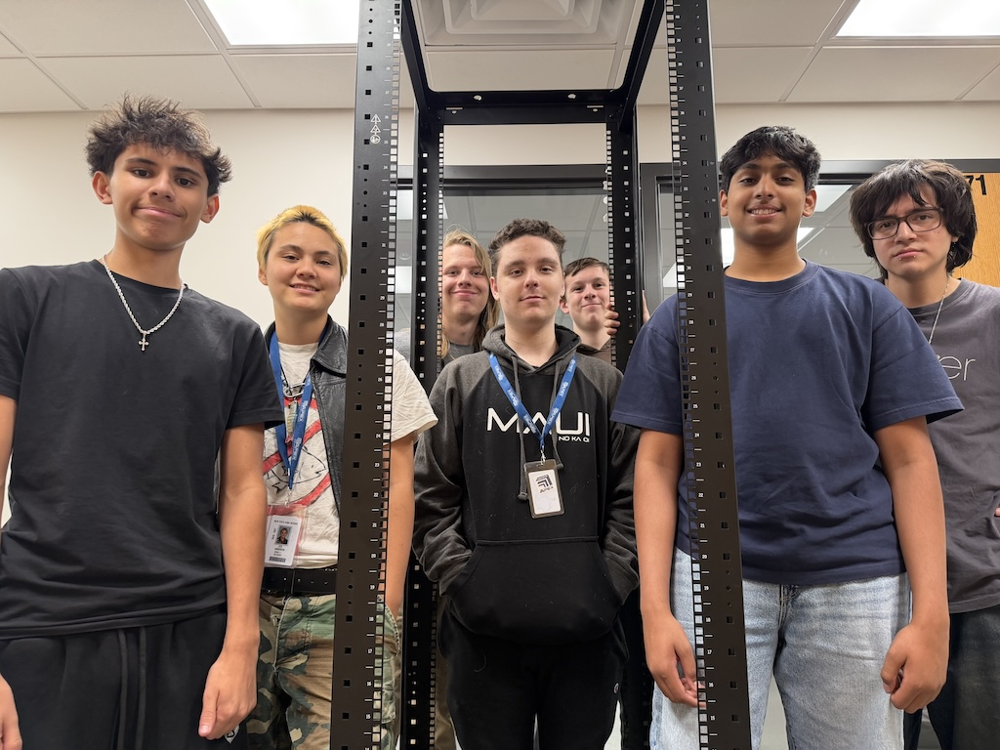

# CS Lab and Rack Setup

Images | August 2026

## Summary

We were assigned groups which undertook different roles in setting up the workstations and the server rack.

**Project:** CS Lab and Rack Setup 

**My role:** Avaneesh, Yanitxan, and I worked on setting up workstations 7, 8, and 9. After this, I set up workstations 16, 17, and 18 on my own. I also worked with this same group verifying the previous group's work on the server rack and making sure everything was secure.

## The Artifact

[This is the top view of one of the workstations I worked on.]

[View the full artifact](./IMG_8083.JPG)

[This is the bottom view of the same workstation as above.]

[View the full artifact](./IMG_8084.JPG)

[This photo shows Nyx (on the right) and Iggy (on the left) working on assembling the server rack.]

[View the full artifact](./rack_1.jpg)

[This photo shows Jasiahs (on the right) and Nate (on the left) working on assembling the server rack.]

[View the full artifact](./rack_2.jpg)

[This photo shows Yanitxan (on the right), Avaneesh (in the middle), and CJ (me)(on the left) tightening everything and verifying its structural integrity.]

[View the full artifact](./rack_3.jpg)

[This last photo shows all of us around the completed server rack.]

[View the full artifact](./rack_4.jpg)

## Skills Demonstrated

Collaboration
Responsibility & Reliability

## What I Learned

I learned the importance of checking to make sure everything is properly in place and working as intended before moving on to other major steps.

---

[Return to All Artifacts]({{ '/artifacts.html' | relative_url }})